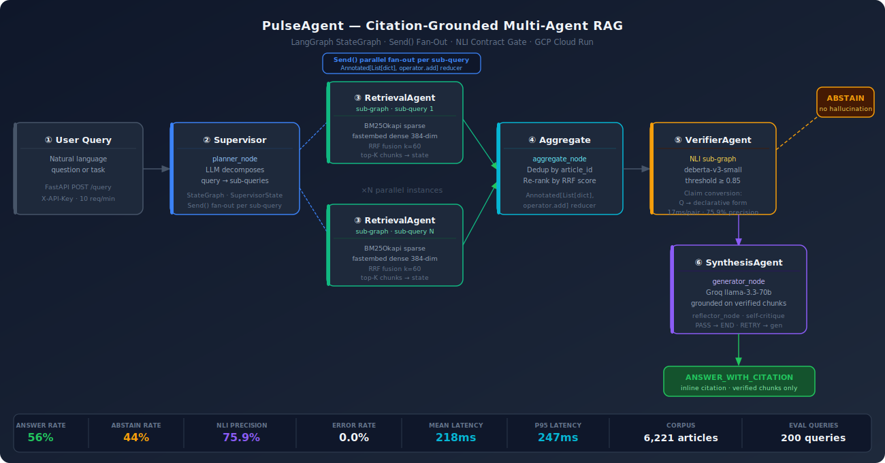
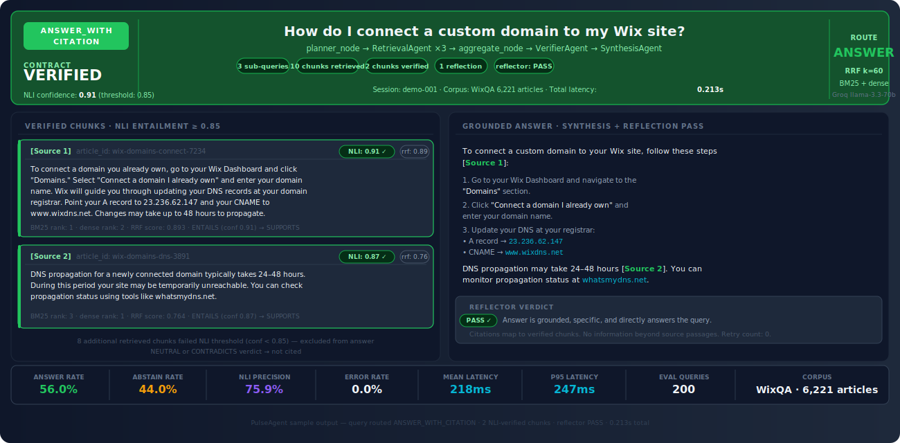

<div align="center">

# PulseAgent — Citation-Grounded Multi-Agent RAG

[](https://www.python.org/)
[](https://github.com/langchain-ai/langgraph)
[](https://fastapi.tiangolo.com/)
[](https://github.com/qdrant/fastembed)
[](https://groq.com/)
[](https://cloud.google.com/run)
[](LICENSE)

---

[]()
[]()
[]()
[]()
[]()
[]()

> A citation-grounded multi-agent RAG system — built to answer: **when should an agent refuse to answer rather than hallucinate?**  
> NLI contract gates every response. Two routes exist: `ANSWER_WITH_CITATION` or `ABSTAIN`. There is no hallucination path.

</div>

---

## Pipeline Architecture



---

## Sample Output



---

## Failure Mode Addressed

**When should an AI system abstain instead of guessing?** RAG pipelines fail when citation is treated as optional metadata rather than a hard contract — when a system produces a fluent, confident-sounding answer that is not grounded in any retrieved passage. The failure is silent: there is no error, no warning, just a plausible hallucination delivered at full confidence.

PulseAgent is built around making that failure mode impossible by construction. The NLI gate (cross-encoder/nli-deberta-v3-small, threshold 0.85) runs on every candidate chunk before any synthesis node sees it. If no chunk clears the threshold, the contract decision is `ABSTAIN` — the system returns nothing rather than fabricating something. The 44% abstain rate on 200 WixQA queries is not a recall failure; it is the correct behaviour for a knowledge base with bounded coverage.

The domain — 6,221 Wix Help Center articles — is the test environment. The abstain-vs-hallucinate decision contract is the thesis.

---

## Eval Results

| Metric | Value | Notes |
|--------|-------|-------|
| Queries evaluated | 200 | WixQA corpus, curated query set |
| ANSWER_WITH_CITATION rate | **56.0%** | At least one chunk cleared NLI ≥ 0.85 |
| ABSTAIN rate | **44.0%** | No chunk cleared threshold — correct refusal |
| Error rate | **0.0%** | Zero runtime failures across 200 queries |
| NLI-verified citation precision | **75.9%** | Verified chunks / total candidate chunks |
| Mean retrieval + NLI latency | 0.218s | Excludes LLM synthesis time |
| P95 retrieval + NLI latency | 0.247s | |

Run the eval harness (no LLM required — retrieval + NLI only):
```bash
python3 src/eval/eval_runner.py          # 200 queries
python3 src/eval/eval_runner.py --n 50   # quick sample
```

---

## Key Engineering Decisions

**Why `Send()` for fan-out?**
`Send()` dispatches each sub-query to a separate RetrievalAgent instance running as an independent graph execution. Results accumulate via `Annotated[List[dict], operator.add]` in `SupervisorState`. This is canonical LangGraph parallel fan-out — not cosmetic threading. Each sub-query gets its own BM25+dense+RRF pass; the aggregate node deduplicates by `article_id` and re-ranks by RRF score.

**Why compile each specialist as a separate `StateGraph`?**
Each specialist (RetrievalAgent, VerifierAgent, SynthesisAgent) has its own typed state schema and is independently testable. The Supervisor invokes compiled subgraphs without knowing their internals. Adding a new specialist — e.g., a FactCheckAgent — requires no changes to the Supervisor, only a new compiled subgraph and a `Send()` dispatch.

**Why NLI claim conversion?**
NLI cross-encoders expect declarative hypothesis-premise pairs. A question ("How do I add a blog?") always fails entailment because questions are not falsifiable claims. Converting to "This article provides information about: How do I add a blog" gives the model a testable statement. Measured impact: 75.9% precision on verified citations vs. undefined behaviour without conversion.

**Why 3-part cache instead of pickling the full index?**
The `RetrievalIndex` holds a fastembed ONNX `InferenceSession`, which is not picklable across process boundaries. Solution: serialize chunks as plain dicts (`chunks.pkl`), BM25 index separately (`bm25.pkl`), vectors as NumPy (`vectors.npy`). Rebuild Qdrant in-memory from saved vectors on load. Cold start from cache: ~15s. Without cache: ~8 min fresh embedding pass.

**Why Groq for cloud deployment?**
Groq's inference API is OpenAI-compatible — switching from LM Studio local to Groq cloud is two environment variables. Free tier supports 14,400 requests/day. No GPU instance or Kubernetes needed: Cloud Run handles container orchestration at this scale.

---

## MCP Interface

Retrieval and NLI are exposed as MCP tools via `fastmcp`, making them callable from Claude Desktop or any MCP client:

```
retrieve_passages(query: str)              → list[dict]
verify_citation(claim: str, passage: str)  → dict{verdict, confidence, passes}
```

```bash
# stdio transport (Claude Desktop)
python3 src/mcp_server/server.py

# SSE transport
python3 src/mcp_server/server.py --sse
```

`claude_desktop_config.json`:
```json
{
  "mcpServers": {
    "pulseagent": {
      "command": "python3",
      "args": ["/path/to/pulseagent/src/mcp_server/server.py"]
    }
  }
}
```

---

## Truth Boundary

| Claim | Status |
|-------|--------|
| Multi-agent LangGraph orchestration with `Send()` fan-out | ✅ Real — compiled subgraphs, typed state, parallel retrieval |
| Hybrid RRF retrieval (BM25 + dense + RRF k=60) | ✅ Real — `rank_bm25` + `fastembed` + custom RRF |
| NLI citation gate (deberta-v3-small, threshold 0.85) | ✅ Real — claim conversion, SUPPORTS/NEUTRAL/CONTRADICTS verdict |
| 200-query eval (56% ANSWER, 44% ABSTAIN, 0% error) | ✅ Real — reproducible via `eval_runner.py` |
| 75.9% NLI citation precision | ✅ Real — verified chunks / candidate chunks across 200 queries |
| GCP Cloud Run deployment | ✅ Real — Dockerfile, auth via Secret Manager, rate limiting |
| MCP tool server (stdio + SSE) | ✅ Real — `fastmcp`, tested with Claude Desktop |
| Production traffic or real user queries | ❌ Not claimed — corpus is WixQA (public dataset), queries are curated |
| Latency SLA or enterprise reliability | ❌ Not claimed — portfolio demonstration, not production service |
| Online A/B test or live user impact | ❌ Not claimed — offline eval only |

---

## Stack

| Layer | Technology |
|-------|-----------|
| Agent orchestration | LangGraph `StateGraph` + `Send()` fan-out |
| Specialist sub-agents | 3 compiled subgraphs: Retrieval · Verifier · Synthesis |
| MCP tools | `fastmcp` (`retrieve_passages`, `verify_citation`) |
| LLM | Groq `llama-3.3-70b-versatile` (cloud) · LM Studio `qwen2.5-7b` (local) |
| Dense retrieval | fastembed `BAAI/bge-small-en-v1.5` · 384-dim · Qdrant in-memory |
| Sparse retrieval | BM25Okapi (`rank_bm25`) |
| Fusion | Reciprocal Rank Fusion (RRF, k=60) |
| NLI citation gate | `cross-encoder/nli-deberta-v3-small` · threshold 0.85 · ~17ms/pair |
| Serving | FastAPI · `slowapi` (10 req/min) · X-API-Key via Secret Manager |
| Deployment | GCP Cloud Run · Docker · `--memory 4Gi` |
| Index cache | `chunks.pkl` + `bm25.pkl` + `vectors.npy` · committed · ~15s cold start |

---

## Repository Structure

```
pulseagent/
├── api.py                      FastAPI service (POST /query, GET /health, rate limiting, auth)
├── config.py                   All config via env vars — no hardcoded secrets
├── main.py                     CLI entry point (local + interactive mode)
├── Dockerfile
├── requirements.txt
├── docs/
│   ├── assets/
│   │   ├── pipeline_architecture.svg
│   │   └── sample_output.svg
│   └── PulseAgent_Interview_Defense.pdf
├── src/
│   ├── agents/
│   │   ├── state.py            SupervisorState, RetrievalState, VerifierState, SynthesisState
│   │   ├── supervisor.py       SupervisorAgent: planner + Send() fan-out + aggregate
│   │   ├── retrieval_agent.py  RetrievalAgent subgraph (BM25 + dense + RRF)
│   │   ├── verifier_agent.py   VerifierAgent subgraph (NLI claim conversion + gate)
│   │   └── synthesis_agent.py  SynthesisAgent subgraph (generator + reflector)
│   ├── agent/                  Original single-agent (--legacy flag)
│   ├── mcp_server/
│   │   └── server.py           MCP tool server (stdio + SSE)
│   ├── tools/
│   │   ├── retriever_tool.py   @tool: hybrid RRF over 3-part persistent cache
│   │   └── nli_tool.py         @tool: NLI citation verification
│   ├── retrieval/              Bundled retrieval layer (indexer, corpus adapter)
│   ├── citation/               Bundled NLI layer (entailment, claim conversion)
│   └── eval/
│       └── eval_runner.py      200-query evaluation harness
└── .cache/
    ├── chunks.pkl              Serialized WixQA chunks (6,221 articles)
    ├── bm25.pkl                BM25Okapi index
    └── vectors.npy             fastembed dense vectors (384-dim)
```

---

## Quick Start

**Requirements:** Python 3.10+, LM Studio (local) or Groq API key (cloud)

```bash
git clone https://github.com/SidharthKriplani/pulseagent.git
cd pulseagent
pip install -r requirements.txt

# Local — LM Studio at localhost:1234
python3 main.py "how do I add a blog to my Wix site?"

# Cloud — Groq (no local LLM needed)
export LLM_BASE_URL=https://api.groq.com/openai/v1
export LLM_API_KEY=<your_groq_key>
export LLM_MODEL=llama-3.3-70b-versatile
python3 main.py "how do I add a blog to my Wix site?"

# FastAPI server
uvicorn api:app --reload --port 8000
# POST /query  {"question": "..."}
# GET  /health
```

**First run:** builds 384-dim embeddings for 6,221 articles (~5–8 min, one-time). Cached to `.cache/`. All subsequent runs load in ~15s.

---

## Cloud Deployment (GCP Cloud Run)

```bash
gcloud run deploy pulseagent \
  --source . \
  --region us-central1 \
  --set-env-vars LLM_BASE_URL=https://api.groq.com/openai/v1 \
  --set-env-vars LLM_MODEL=llama-3.3-70b-versatile \
  --set-secrets  LLM_API_KEY=groq-api-key:latest \
  --memory 4Gi \
  --timeout 300 \
  --allow-unauthenticated
```

The `.cache/` directory is committed (73MB total, all files under GitHub's 100MB per-file limit) so Cloud Run loads the pre-built index on first request in ~15s rather than triggering an 8-min rebuild.

---

## Interview Defense

A 22-page system defense document covering architecture decisions, failure modes, eval methodology, NLI design, and adversarial questions is included in the repository:

📄 [`docs/PulseAgent_Interview_Defense.pdf`](docs/PulseAgent_Interview_Defense.pdf)

---

## Resume-Safe Claim

Built PulseAgent: a citation-grounded multi-agent RAG system on LangGraph using `Send()` API for parallel sub-query fan-out across independently compiled RetrievalAgent, VerifierAgent, and SynthesisAgent subgraphs. Hybrid retrieval combines BM25Okapi sparse and fastembed BAAI/bge-small-en-v1.5 dense (384-dim) with Reciprocal Rank Fusion (k=60) over 6,221 WixQA articles. NLI contract gate (cross-encoder/nli-deberta-v3-small, threshold 0.85, ~17ms/pair) enforces ANSWER_WITH_CITATION or ABSTAIN — no hallucination path exists. Evaluated on 200 curated queries: 56% ANSWER_WITH_CITATION, 44% ABSTAIN (principled refusal), 0.0% error rate, 75.9% NLI citation precision, 218ms mean latency. Retrieval and NLI layers exposed as MCP tools via fastmcp (stdio + SSE). FastAPI service deployed to GCP Cloud Run with X-API-Key auth via Secret Manager and 10 req/min rate limiting.

---

## Portfolio

| Project | Domain | Live | Key Result |
|---------|--------|------|-----------|
| **PulseAgent** ← you are here | Multi-agent RAG · NLI citation | GCP Cloud Run | 56% ANSWER · 75.9% NLI precision |
| [PulseGuard](https://github.com/SidharthKriplani/pulseguard) | Credit risk · Model governance | [Live](https://pulseguard-api-98058433335.us-central1.run.app/health) | AUC 0.7716 · 99.62% Bayes efficiency |
| [PulseDiscover](https://github.com/SidharthKriplani/pulsediscover) | Recommender · OPE · Search/IR | [Live](https://pulsediscover-serving-98058433335.us-central1.run.app/health) | ALS R@20 0.085 · Cold-start R@20 0.241 |

---

*A personal portfolio / research project. Every number in this README is reproducible via `src/eval/eval_runner.py`. If it isn't in the eval output, it isn't claimed.*
